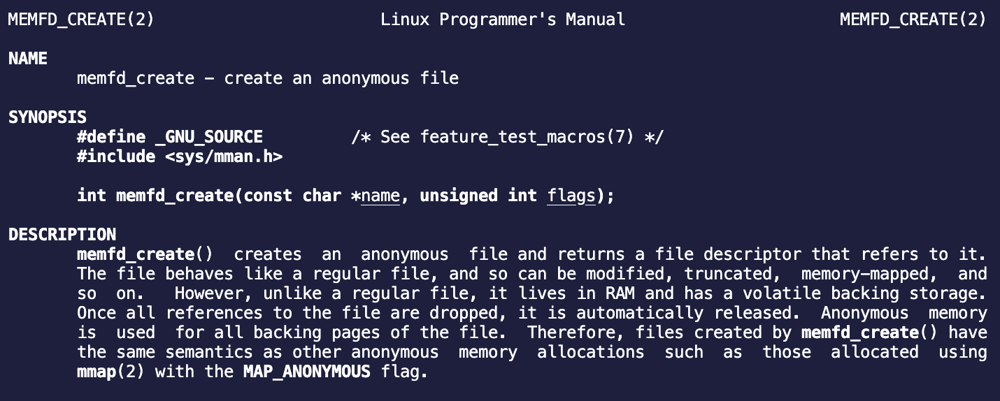
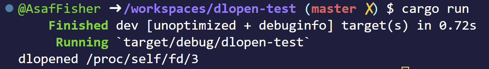
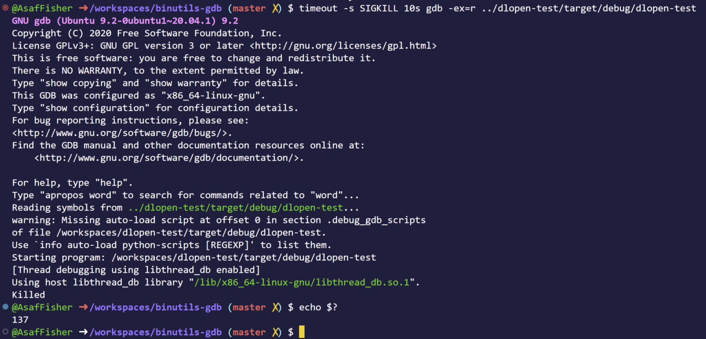
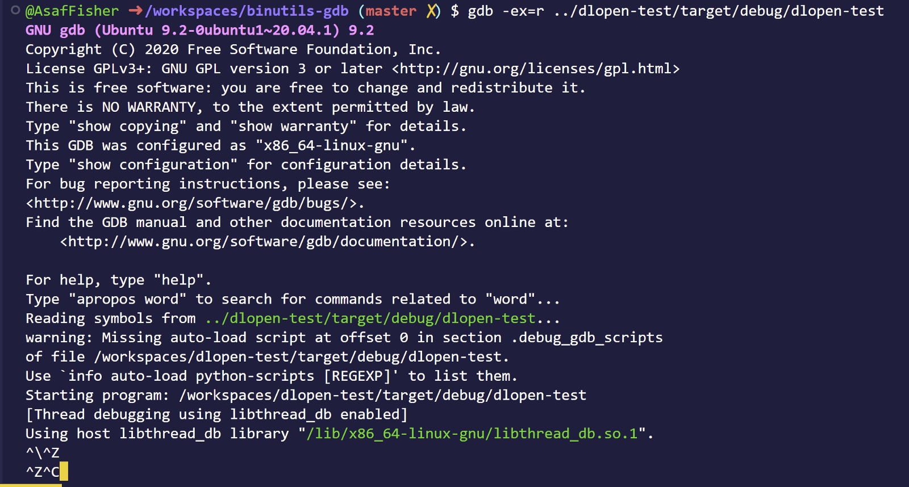
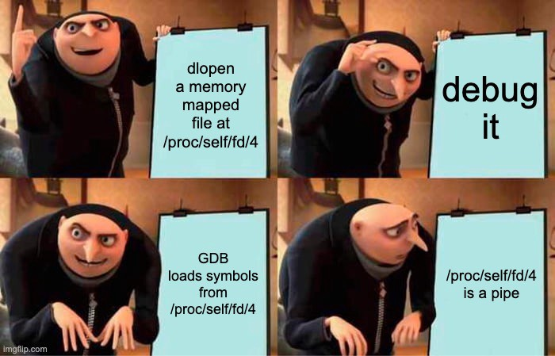
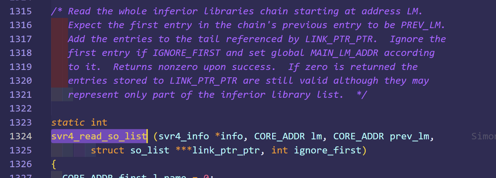
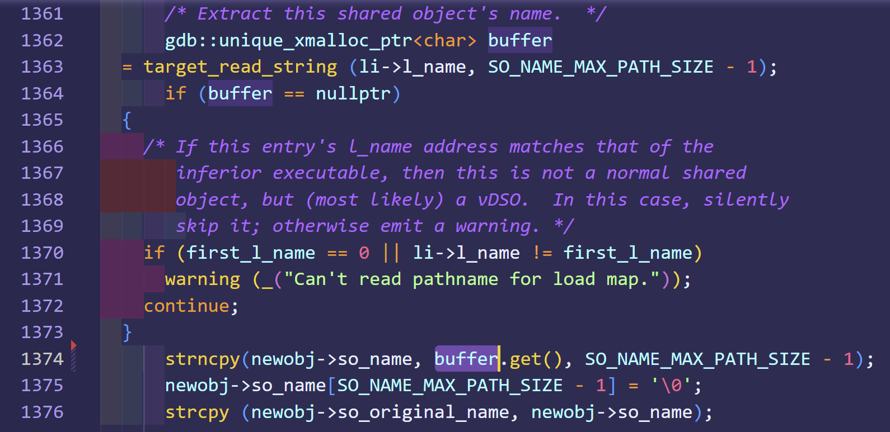

When You Find A Logical Bug In GDB (and other linux debuggers)
==============================================================

I am going to talk about a bug I found in GDB. I hope some of you might learn from the methods I use to investigate how GDB works without getting into a large code base and get familiar too much with a product.

The BUG was actually found when I investigated how GDB loads symbols from inferior's `dlopen`.

To be honest, this logical bug is in someway a new anti-debugging method that most linux distro's will "support". This bug is special in my opinion because it can show how logical bugs can be reduced between different codebases.

Let's load a `.so` file from memory mapped file. Typically what you'd want to do, is to load a `.so` file to the program's memory and write it to the memory-mapped file:

```rust
use memfd; 
use std::io::Write; 

// Create a memory mapped file. [1]
let mfd = memfd::MemfdOptions::default()
                     .allow_sealing(true)
                     .create("mapped-so").unwrap(); 

// Read the .so from the file system. 
let buff = std::fs::read("/usr/lib64/ld-linux-x86–64.so.2").unwrap();

// Write it to the memory mapped file. [2]
mfd.as_file().write(buff.as_slice()).unwrap();
```
Wait, what am I doing here? What is `mfd`/`memory mapped file`? Why can you `write` to it?



Basically on [1], you are holding an fd to simulated file living in the machine's RAM, (see linux kernel implementation [`/mm/shmem.c`](https://elixir.bootlin.com/linux/latest/source/mm/shmem.c#L3877) or [`/fs/hugetlbfs/inode.c`](https://elixir.bootlin.com/linux/latest/source/fs/hugetlbfs/inode.c#L1168)). Then on [2] we write the `.so`'s data to that memory-mapped file.

Now in order to use `dlopen`, we need to have a valid path to that `.so` to do so we will use `/proc`.

> `/proc` is a special path in most linux distros, it has a filesystem called `procfs` mounted to it by the kernel on startup. `procfs` gives you a lot of
> information about the machine, processes, memory management, etc. 
>
> For example, you could see all opened files of a process by running 
> `ls -all /proc/[PID]/fd`. 
> Each file in this path is a link to an existing file. 
>
>**A process can access its own pid's information in short using the `/proc/self/` prefix.**


Cool, so now when we have our `.so` memory mapped into an `fd`, we could `dlopen` it using `/proc/self/fd/[fd of memory mapped .so]`.

```rust
use memfd;
use dlopen_derive::{self, WrapperApi};
use dlopen::wrapper::{Container,WrapperApi};

#[derive(WrapperApi)]
struct Api{
    free: unsafe extern "C" fn(pointer: *const()),
}

fn load_so(mfd: memfd::Memfd){
    let fd = mfd.as_file().as_fd().as_raw_fd();
    let fm = format!("/proc/self/fd/{}", fd);
    
    // dlopen the file on the path pointed by fm
    let mut _cont: Container<Api> = unsafe { 
            Container::load(&fm) }.expect("Could not open library or load symbols");
    println!("dlopened {}", fm);
}
```
Essentially when open (`dlopen`) is called with `/proc/self/fd/[fd_num]` as a parameter, the kernel maps the same file structure to a new `fd` used by `dlopen` to map the `.so`.

You might be saying, yah yah I know all these what's the meme here (its gonna come)?
Well lets try to run it!




It worked! We dlopened the memory mapped file! 

Lets debug it!



GDB freezes on us, WTF? I can't ctrl-d, ctrl-z, ctrl-c nothing



GDB will just not response, ever.

Lets take a deeper look at what's going on:


Okay, from the second column we see that out dlopen-test process has the t flag which means (`man ps`):
```
T    stopped, either by a job control signal or because it is being traced.
```

Cool, so our program is in a stop state where in the kernel mode it is handled by `ptrace`(column 11 shows what kernel function the process hangs on)… legit.


Well, looks like GDB is reading from a… `pipe`? Lets strace it!

```bash
$ strace gdb -ex=r ../dlopen-test/target/debug/dlopen-test
rt_sigaction(SIGTTOU, {sa_handler=SIG_DFL, sa_mask=[TTOU], sa_flags=SA_RESTORER|SA_RESTART, sa_restorer=0x7f7ceed46090}, {sa_handler=SIG_IGN, sa_mask=[TTOU], sa_flags=SA_RESTORER|SA_RESTART, sa_restorer=0x7f7ceed46090}, 8) = 0
stat("/proc/12156/ns/mnt", {st_mode=S_IFREG|0444, st_size=0, ...}) = 0
openat(AT_FDCWD, "/proc/self/fd/3", O_RDONLY|O_CLOEXEC) = 15
fstat(15, {st_mode=S_IFIFO|0600, st_size=0, ...}) = 0
fcntl(15, F_GETFL)                      = 0x8000 (flags O_RDONLY|O_LARGEFILE)
fstat(15, {st_mode=S_IFIFO|0600, st_size=0, ...}) = 0
fstat(15, {st_mode=S_IFIFO|0600, st_size=0, ...}) = 0
fstat(15, {st_mode=S_IFIFO|0600, st_size=0, ...}) = 0
fstat(15, {st_mode=S_IFIFO|0600, st_size=0, ...}) = 0
read(15, ^C^C^[[A^\ <unfinished ...>)             = ?
```
Line 7 looks familiar ain't it? 
It's the path of the memory mapped file on the inferior process (the process GDB is debugging). 

Why would GDB open a path that the inferior opens?

GDB has a hook on dlopen and every time the program `dlopen`` a file, GDB opens it to read its symbols. After a small debugging session I indeed saw that when dlopen is called, the process gets into a stop signal and GDB gets stuck.

Cool! 

So GDB's trying to load a shared object from `/proc/self/fd/4` of its **Inferior**! 

GDB **has no** memory mapped file with an `fd` of 4, as a matter of a fact, GDB's `/proc/self/fd/4` has a `pipe`.




So the root cause is that GDB does not expect to get a path that could change depending on the process that opens that path.

Wow, That means we can cause `GDB`/`GDBServer` to read from **any** opened `file/pipe/socket` **it owns**! Crazy… Imagine reading some bytes from a `socket` causing GDB to interpret a command from the client differently. This is indeed an opening to some nasty bugs.


Finding the bug!
----------------

After diving in for about 10 min of intensive hard-labored search in the code base (thats a-lot of time I think) I've found this file `solib-svr4.c` that contains the code that loads share objects from the inferior:



Here the devil is on line 1374, copy the raw so name to the list of inferior's shared objects that GDB handles.



Workaround
----------
There is a workaround to make sure GDB will not get stuck, but it requires you to disable GDB's feature of automatically loading shared objects on dl-open. Hence, no symbols for `.so`'s ):

Here is the fix: 


Implications
------------
* Ultimately what I presented here is a nice anti-debugging method, binaries could use this method to annoy anyone whose trying to debug our program. 
* I can see how this bug can lead to crashing of some automatic forensics utils, making it harder to analyze applications automatically.


One last thing
--------------
So, apparently this bug is so generic `ltrace` and `Valgrind` has the exact same bug… So yah try to `ltrace` the program at the beginning and it will Aborted (core dumped).
Its fun to see how the same bug can be applied to multiple products that do similar stuff, reminds me various of bugs in hypervisors that were found on one product (virtualbox) and then rediscovered on different one (hyper-v)
